# JavaFX-library-management-system
## A JavaFX based Desktop Application ##
**Login Screen**

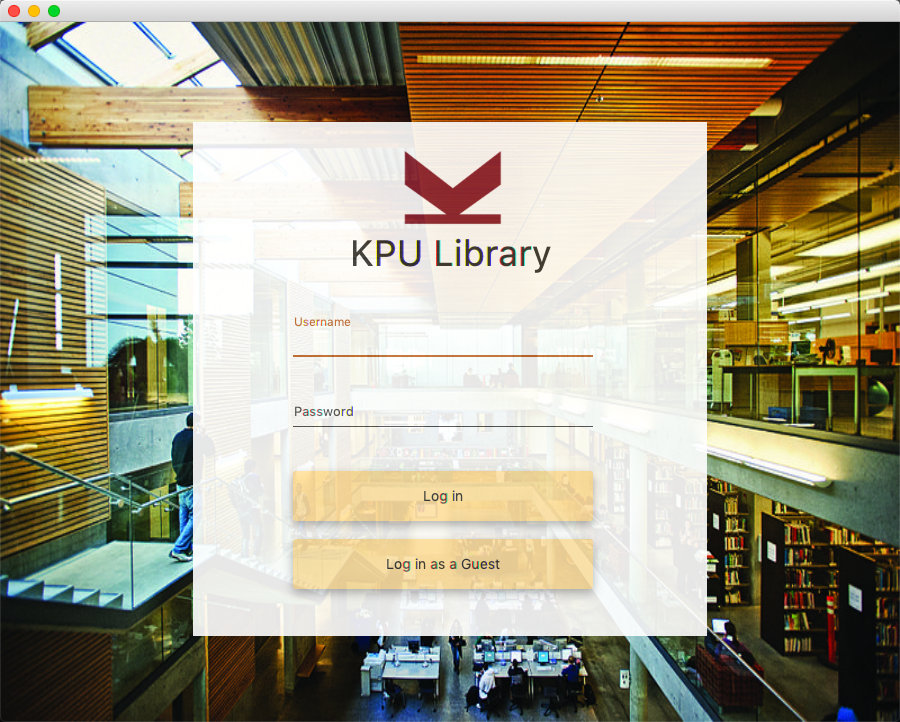

**Login Screen Prompt**

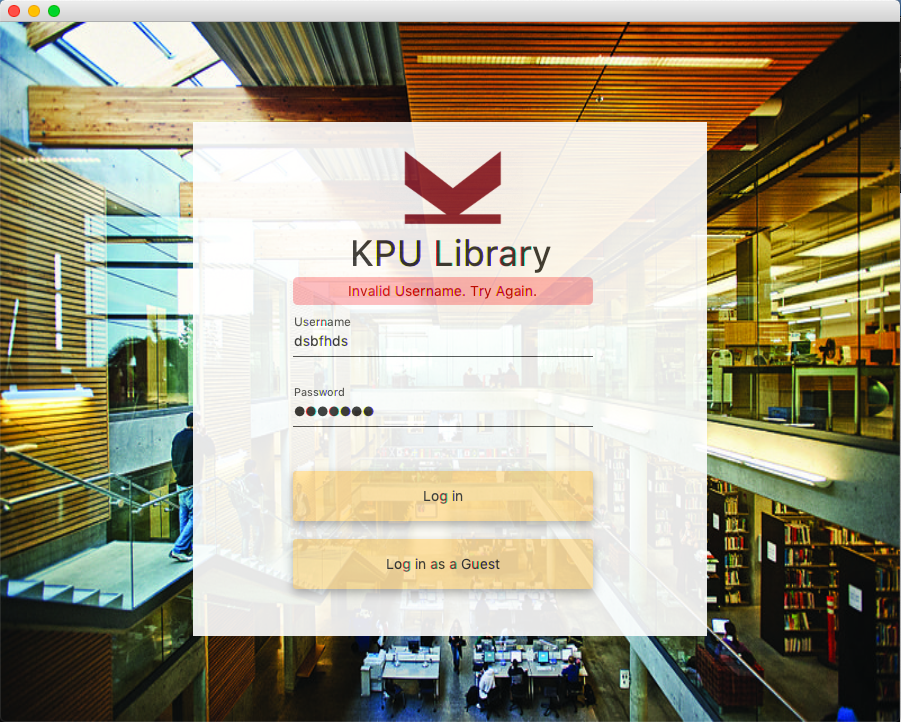

**Admin Home Screen**

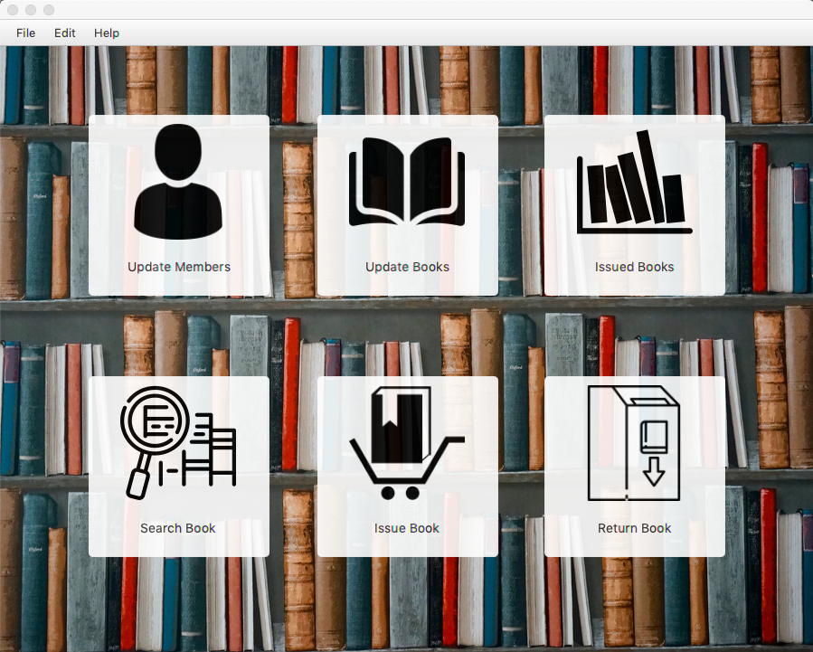

**Normal Home Screen**

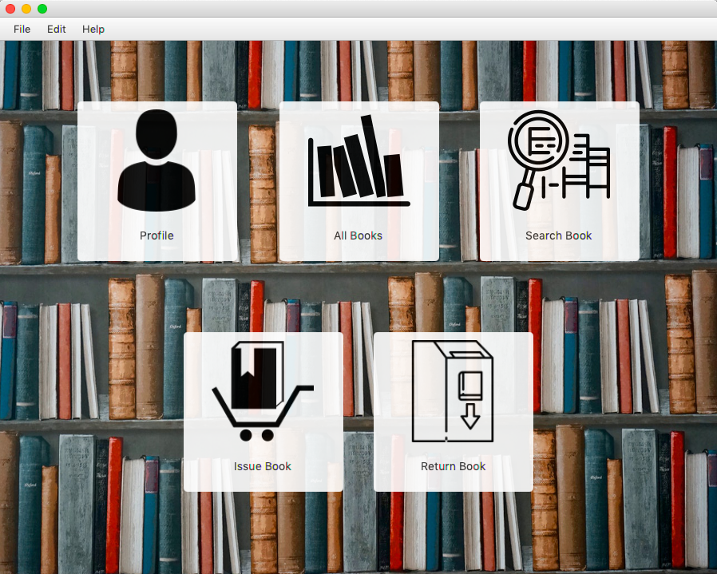

**Guest Home Screen**

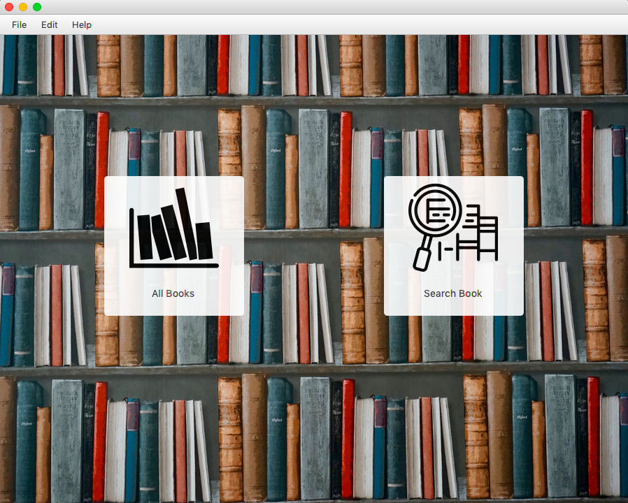

**Side Drawer**

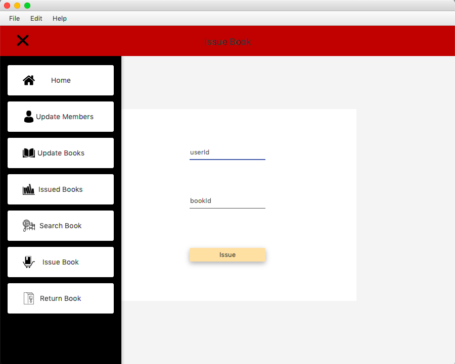

**Admin Home Screen**

**Table**

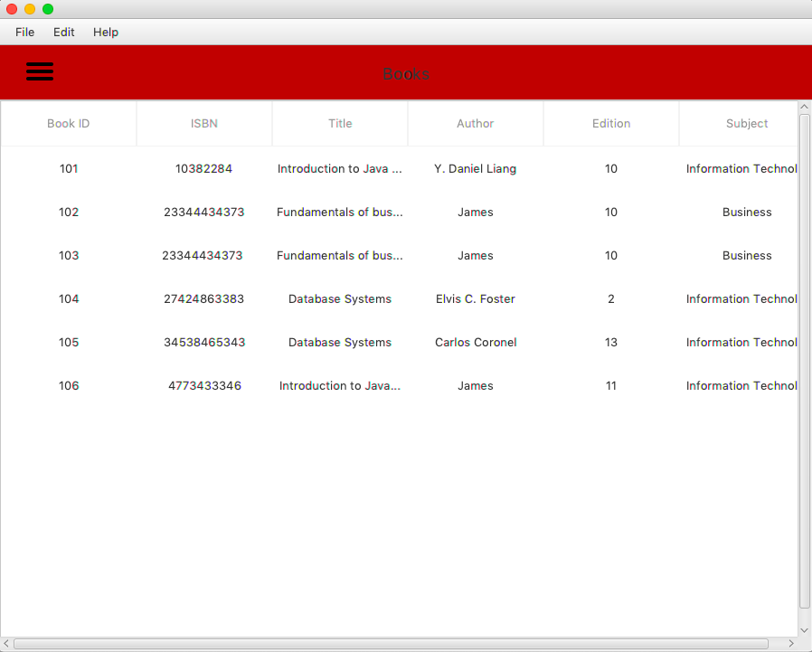

**Profile**

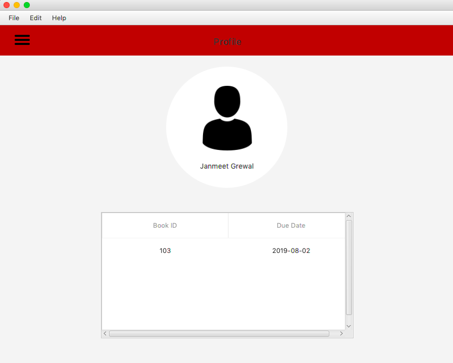

**Update**

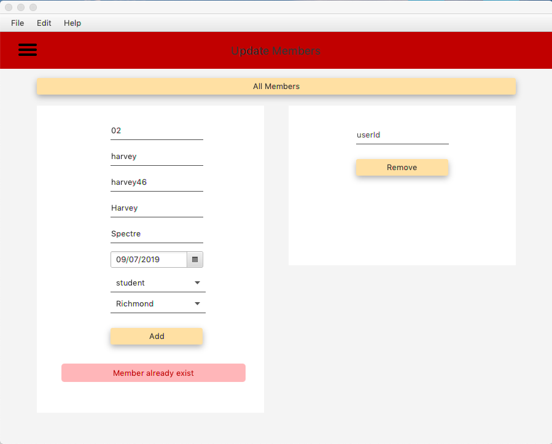

**Update 2**

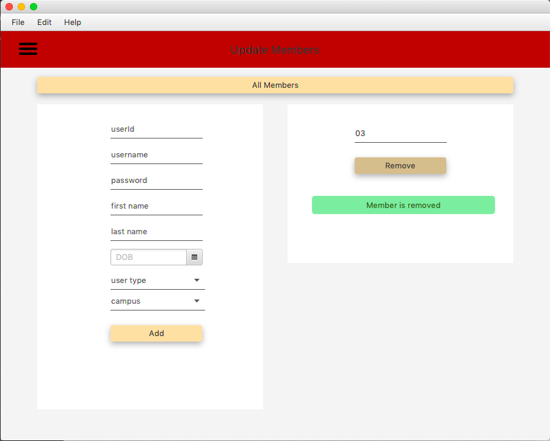

**Search Book 1**

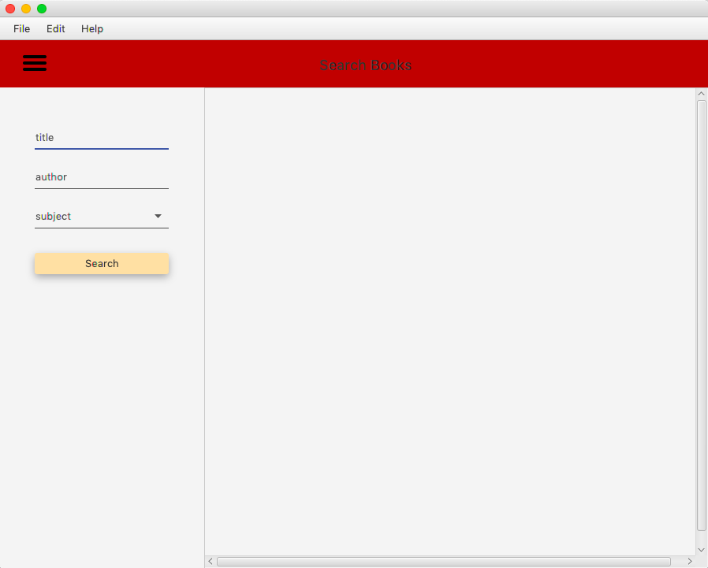

**Search Book 2**

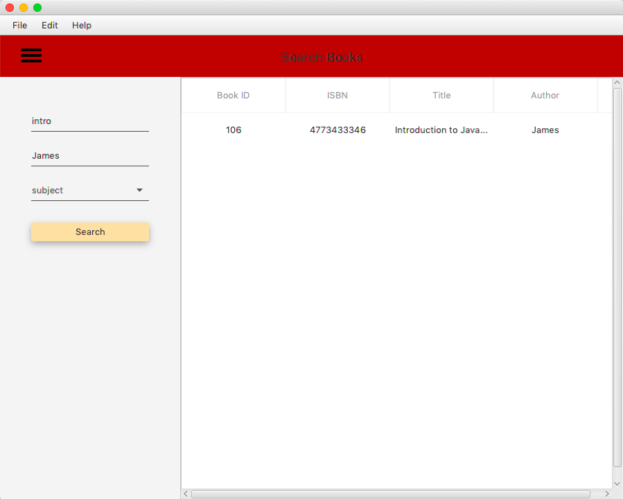

**Issue Book 1**

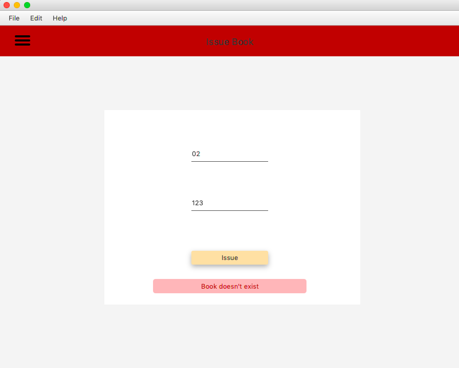

**Issue Book 2**

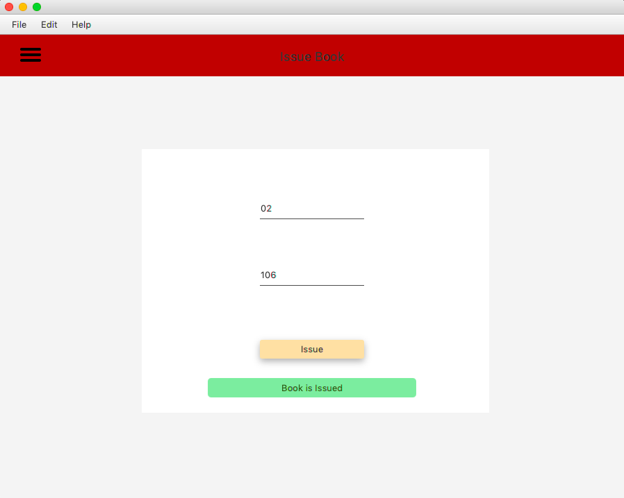

